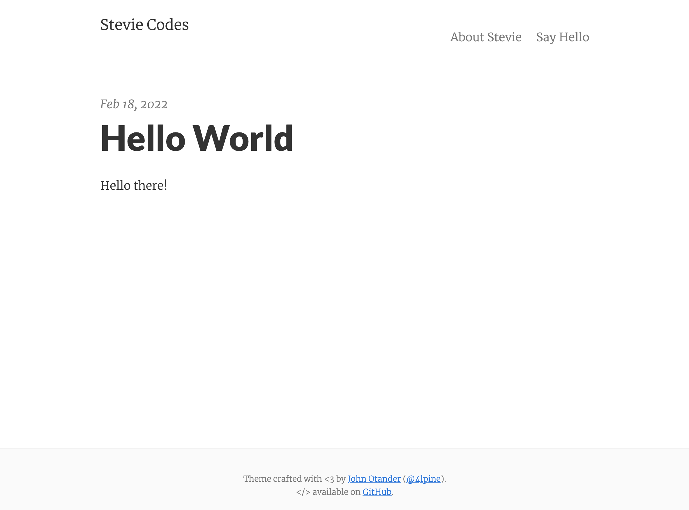

# Stevie Codes



## Description

My blog. Not much else to it.

It's pretty minimal, but leverages large type and drastic contrast to make a statement, on all devices.

This site is built using [jekyll](http://jekyllrb.com) and hosted on [GitHub Pages](https://pages.github.com).

## Install

```bash
gem install bundler # If you don't have bundler installed
bundle install
jekyll serve --watch
```

## Testing

```bash
bundle exec rspec
```

## Adding a blog post

```bash
rake post['<TITLE>']
```
